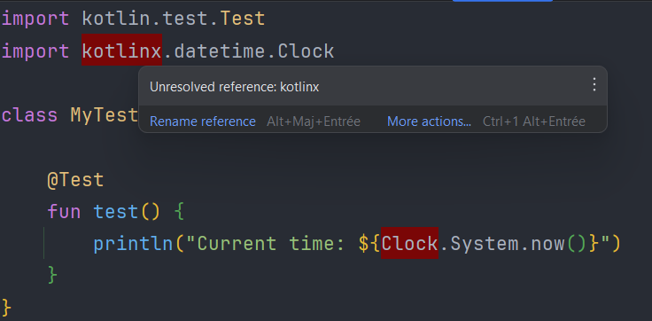
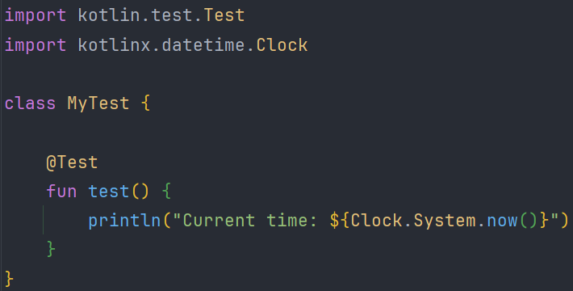

Repository to show the [IDEA](https://www.jetbrains.com/idea) display bug due to the use of [Apollo Plugin](https://github.com/apollographql/apollo-kotlin)

The bug impacts only the IDE display, however the code compiles and runs without any issue.

# How to see the problem

- Open IDEA
- Go on the file [MyTest](src/commonTest/kotlin/MyTest.kt)
- See the error related to the import of dependency

# How to remove the problem

- Go on the file [build.gradle.kts](build.gradle.kts)
- Common the line 6 & 62-66
- Check the file [MyTest](src/commonTest/kotlin/MyTest.kt) and see the error is gone

